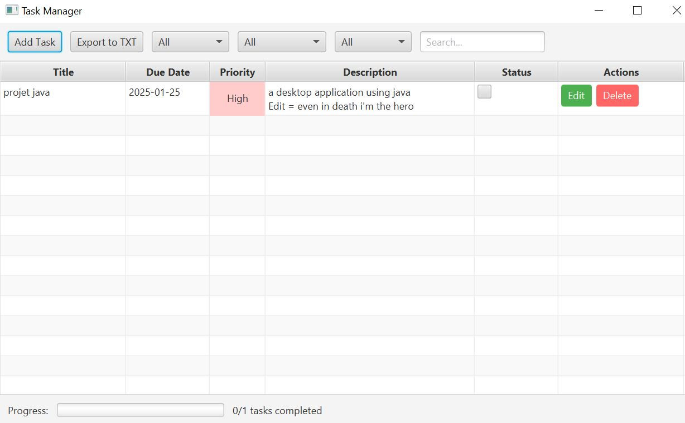
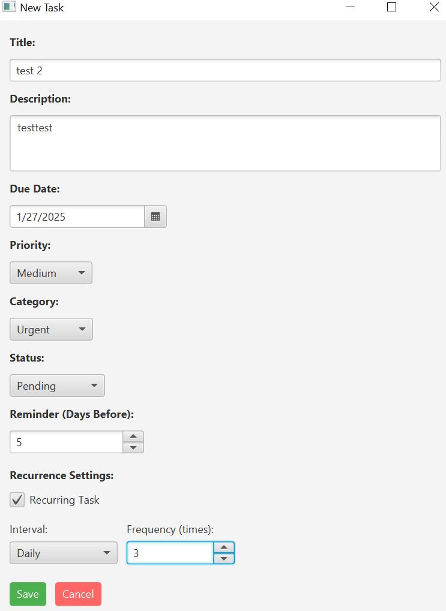
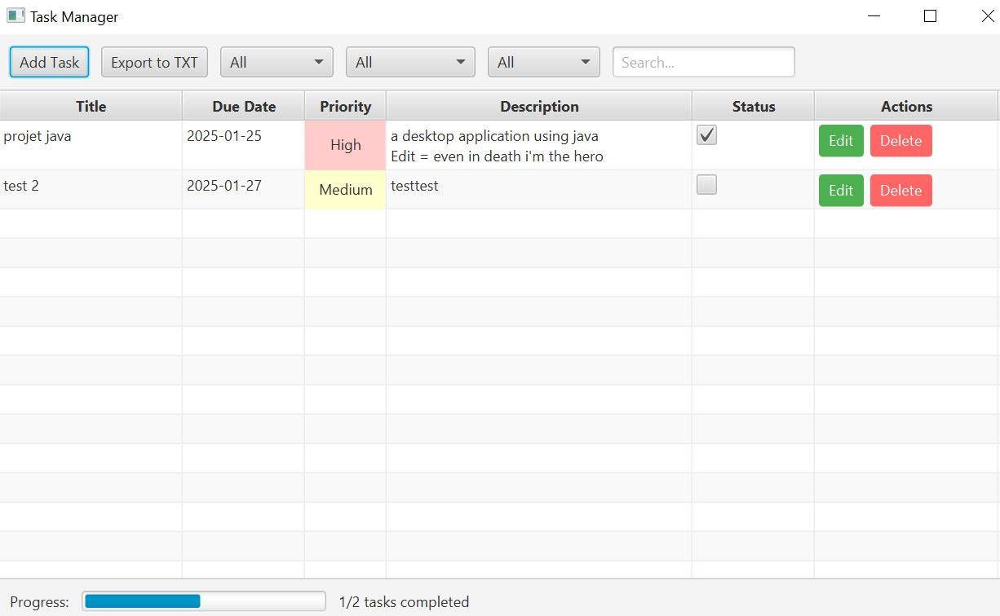
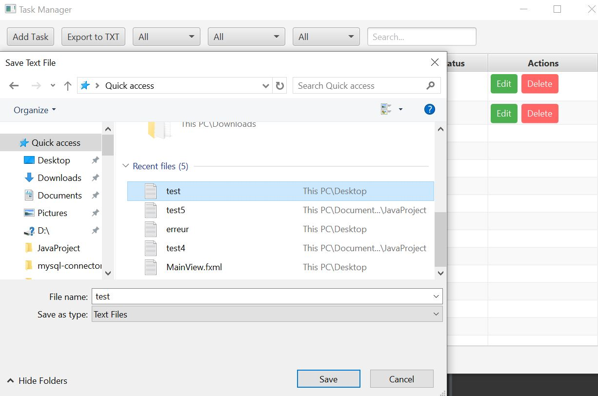
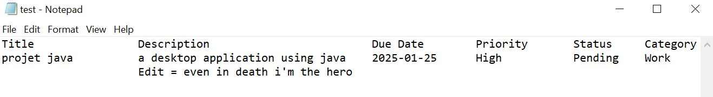

# Task Manager Application



A Java-based desktop application for managing personal tasks. This application allows users to add, edit, delete, and organize tasks with features like priority levels, due dates, categories, and recurring tasks. It also includes a progress tracker and export functionality.

---

## Features

- **Task Management**:
  - Add, edit, and delete tasks.
  - Set task priority (Low, Medium, High).
  - Mark tasks as completed or pending.
  - Set due dates and reminders.

- **Task Organization**:
  - Categorize tasks (e.g., Work, Personal, Urgent).
  - Filter tasks by category, priority, or status.
  - Search for tasks by title.

- **Recurring Tasks**:
  - Set tasks to recur daily, weekly, or monthly.
  - Define the number of recurrences or make them infinite.

- **Progress Tracking**:
  - Visual progress bar showing completed vs. pending tasks.
  - Task count displayed (e.g., "1/2 tasks completed").

- **Export Functionality**:
  - Export tasks to `.txt` or `.csv` files.
  - Export individual tasks or the entire task list.

- **User Interface**:
  - Intuitive and responsive design.
  - Color-coded priorities for better visualization.

---

## Screenshots

### Main Interface


### Adding a New Task


### Task List with Progress


### Exporting Tasks


### Exported Task in Notepad


---

## Technologies Used

- **Programming Language**: Java
- **GUI Framework**: JavaFX
- **Database**: MySQL
- **Build Tool**: Maven (optional)
- **Other Libraries**: JDBC for database connectivity

---

## Setup Instructions

### Prerequisites
1. **Java Development Kit (JDK)**: Ensure you have JDK 11 or higher installed.
2. **MySQL Database**: Install MySQL and create a database named `taskmanager_db`.
3. **MySQL Connector/J**: Download the MySQL JDBC driver and add it to your project's classpath.

### Database Setup
1. Create a MySQL database named `taskmanager_db`.
2. Run the following SQL script to create the necessary tables:

```sql
CREATE TABLE categories (
    category_id INT AUTO_INCREMENT PRIMARY KEY,
    name VARCHAR(50) NOT NULL
);

CREATE TABLE tasks (
    task_id INT AUTO_INCREMENT PRIMARY KEY,
    title VARCHAR(100) NOT NULL,
    description TEXT,
    due_date DATE,
    priority VARCHAR(10),
    status VARCHAR(10),
    category_id INT,
    reminder_days INT,
    is_recurring BOOLEAN,
    recurrence_interval VARCHAR(10),
    recurrence_frequency INT,
    FOREIGN KEY (category_id) REFERENCES categories(category_id)
);
